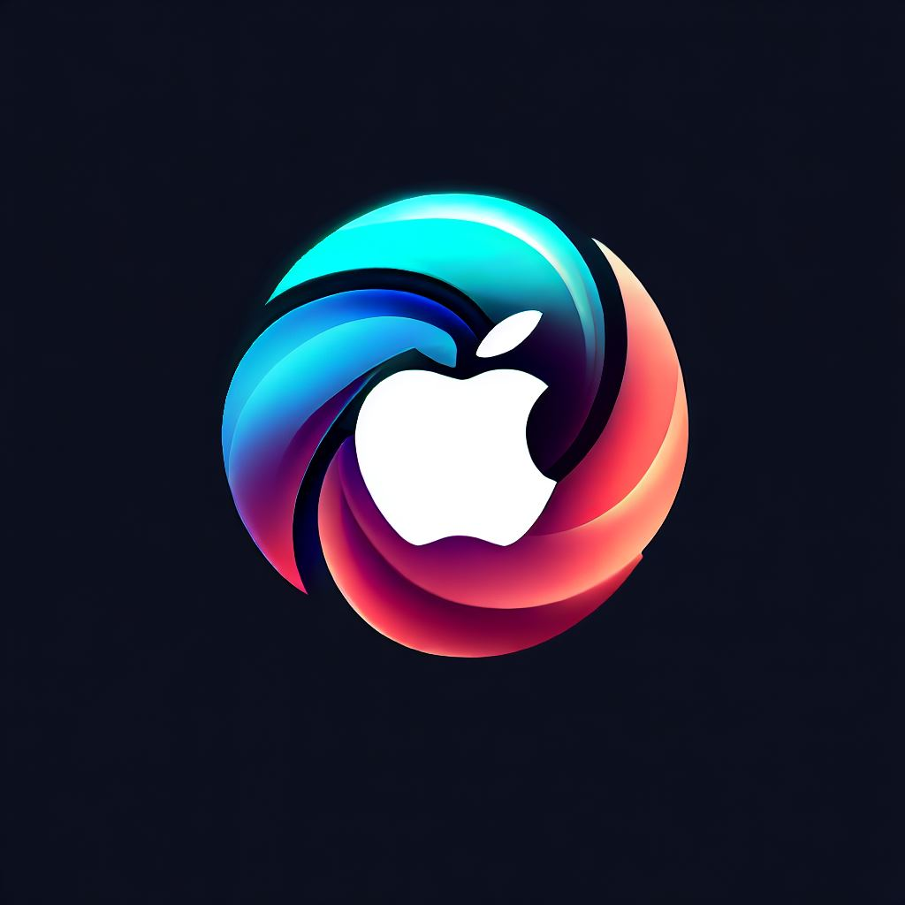

# Meta iOS Developer Professional Certificate

## Introduction
### Why I'm writing this document?
Why I'm writing this document? I'm writing this document to help me remember somne basic concepts of IOS Development. The main idea is to keep adding more examples and code snippets for later reference as I learn more about the tools related to this project.

### AVFoundation
AVFoundation is a framework that is used to play and create audiovisual media. It is a high-level framework that is built on top of Core Media. It is used to play, create, and edit media files. It is also used to capture, process, and output media files.

#### AVFoundation Classes
### AVPlayerItem

### AVPlayer
The AVPlayer is the most efficient way to display and play a video in an Apple app, the AVPlayer is a class that is used to play media content.   

Currently supported formats are:
* iOS:
* H.263
* H.264 AVC
* MPEG-4 SP
* VP8

Using the AVPlayer class.  
**AVPlayer(url: URL(fileURLWithPath: path))** 
This specifies the path (as a URI) of the video media to be played. This can be either a remote video file URL or a local video file on the device.

**play()** When this function is used, it plays the video.

**currentTime()** When this function is used, it gets the current time of playback.

**pause()** This function pauses video playback.

**isMuted ()** This function returns a Boolean value that indicates whether a video is currently muted.

**AVPlayerViewController** The AVPlayerViewController is the UI to control the video. Specifically, it is a view that contains media controls such as "Play/Pause", "Rewind", "Fast Forward" and a progress slider. It also contains a view to display the video.

